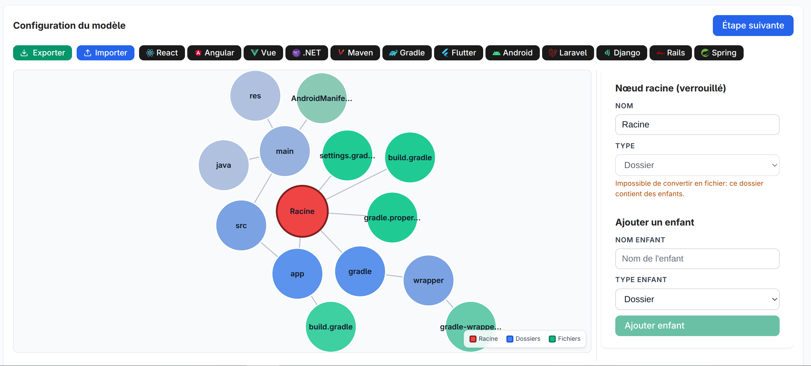
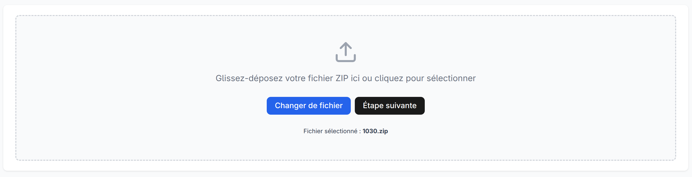
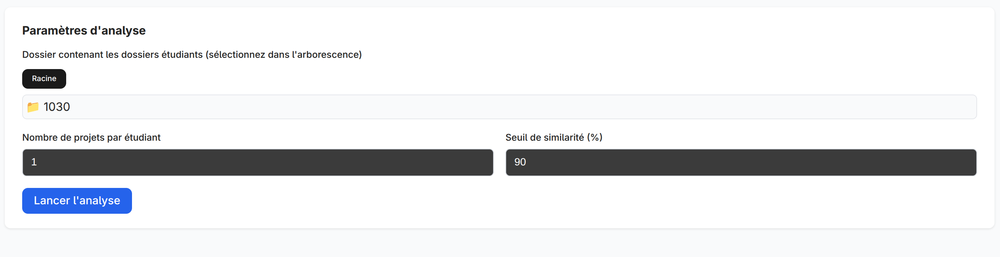
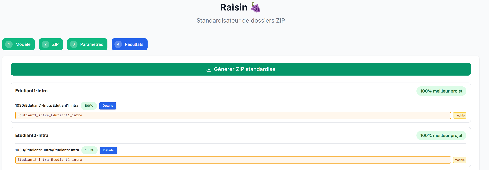

# Raisin - Guide Utilisateur

Raisin vous aide à analyser un lot de projets étudiants contenus dans une archive ZIP et à produire une archive « standardisée » où chaque dossier est renommé de façon homogène selon un modèle que vous définissez.

---

## 1. Ce que vous pouvez faire avec Raisin

1. Créer (ou importer) un modèle d'arborescence attendue (dossiers / fichiers).
2. Charger une archive ZIP contenant plusieurs dossiers d'étudiants.
3. Lancer l'analyse : chaque projet est comparé au modèle et reçoit un score (pourcentage de correspondance).
4. Ajuster manuellement certains chemins proposés si nécessaire.
5. Générer une nouvelle archive ZIP « standardisée » prête à être partagée / corrigée.

---

## 2. Les étapes de l'interface

### Étape 1 – Modèle

- Construisez votre structure cible (clic pour sélectionner un nœud, ajoutez des enfants).
- Vous pouvez exporter ou importer un modèle au format YAML.
- Le bouton « Étape suivante » s'active dès que la racine possède au moins un enfant.

### Étape 2 – ZIP

- Importez votre archive `.zip`.
- Si le fichier n'est pas un ZIP valide, un message vous le signalera.

### Étape 3 – Paramètres

- (Selon la version fournie) définissez les options d'analyse ou lancez directement l'analyse.
- Patientez pendant le traitement.

### Étape 4 – Résultats

- Chaque étudiant apparaît avec :
  - Son score global basé sur son projet ayant la meilleure correspondance avec le modèle choisi.
  - Un avertissement si des projets attendus manquent (si configuré).
  - Les projets Reconnu(s) : vous pouvez adapter le chemin de destination proposé.
- Cliquez sur un projet pour voir les détails ( quels éléments du modèle ont été trouvés ou non ).
- Lancez ensuite la génération du « ZIP standardisé ».

### Galerie d'écrans (exemples)

| Écran              | Description                           | Capture                                        |
| ------------------ | ------------------------------------- | ---------------------------------------------- |
| Éditeur du modèle  | Construction de la structure attendue |          |
| Sélection du ZIP   | Choix de l’archive à analyser         |  |
| Paramètres         | Options / lancement de l'analyse      |  |
| Résultats synthèse | Scores par étudiant                   |    |

---

## 4. Interpréter les scores

- 95% et + : vert (presque totalement conforme)
- 90% – 94% : orange (quelques écarts)
- < 90% : rouge (structure incomplète ou divergente)

Le calcul exact dépend des correspondances de nœuds (présence des dossiers/fichiers du modèle).

---

## 5. Ajuster les chemins

Avant la génération finale, vous pouvez modifier le dossier de destination proposé pour un projet (ex : normaliser un nom erroné ou ajouter un suffixe).  
Ces modifications affecteront l’archive standardisée produite.

---

## 6. Générer l'archive standardisée

- Cliquez sur « Générer ZIP standardisé ».
- Une barre de progression indique l’avancement et les fichiers en cours de copie.
- Vous pouvez annuler pendant le processus.
- Le fichier téléchargé se nomme par défaut `standardized.zip` (ou selon votre configuration future).

---

## 7. Import / Export de modèle YAML

- Export : télécharge un fichier `.yml` représentant votre structure.
- Import : remplace le modèle actuel (hors modifications non sauvegardées).
- Le nœud racine est toujours normalisé en « Racine ».

---

## 8. Conseils pratiques

- Créez un modèle minimal d’abord, puis affinez.
- Si plusieurs projets par étudiant sont possibles, seuls les mieux scorés sont mis en avant (le meilleur détermine le score global).
- Vérifiez les dossiers vides ou inattendus dans les détails d’un projet.
- Conservez une copie de votre modèle exporté si vous travaillez à plusieurs.

---

## 9. Limitations actuelles

- L’algorithme de scoring est simplifié (présence/absence).
- Pas encore d’internationalisation multi-langue complète.
- Pas de gestion avancée des collisions de noms dans la génération finale (les cas complexes peuvent écraser si identiques).

---

## 10. Résolution de problèmes

| Problème             | Cause possible                       | Solution                                       |
| -------------------- | ------------------------------------ | ---------------------------------------------- |
| Le ZIP ne charge pas | Fichier corrompu ou non zip          | Régénérez l’archive, vérifiez l’extension .zip |
| Aucun score élevé    | Modèle trop strict ou mauvais niveau | Simplifiez le modèle puis réessayez            |
| Chemins incohérents  | Noms divergents étudiants            | Renommez via l’interface avant génération      |
| Fichier final vide   | Annulation trop tôt                  | Relancez sans annuler                          |

---

## 11. Questions fréquentes (FAQ)

**Puis‑je modifier le modèle après l’analyse ?** Oui, mais relancer l’analyse sera nécessaire pour de nouveaux résultats cohérents.  
**Les fichiers sont-ils envoyés en ligne ?** L'application fonctionne côté navigateur (selon implémentation) – vérifiez votre version si déployée sur un serveur.  
**Puis‑je utiliser plusieurs modèles ?** Oui, exportez / importez selon le contexte.

---

## 12. Raccourci récapitulatif

1. Ouvrir la page
2. Construire le modèle
3. Importer le ZIP
4. Lancer l’analyse
5. Vérifier / ajuster
6. Générer l’archive standardisée
7. (Optionnel) Exporter le modèle pour le réutiliser

---

Bon usage de Raisin 🍇

Si vous avez besoin d’une version plus technique (déploiement, scripts), demandez le README développeur.
